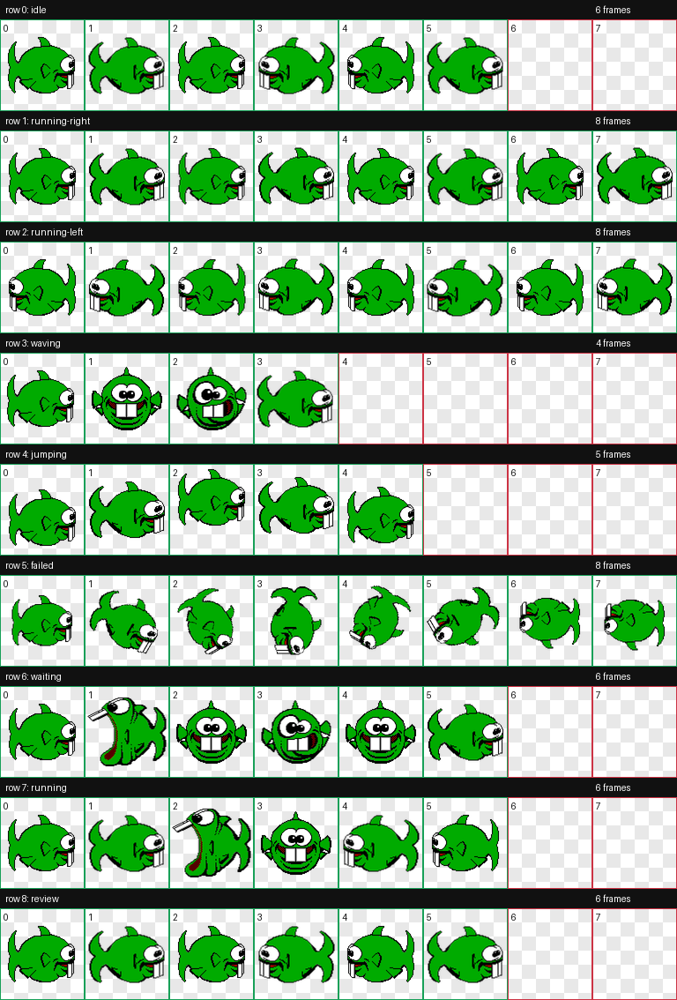

# Dopefish Codex Pet

The second-dumbest creature in the universe can now be your Codex pet. Made with
love. Suggestions welcome.



## Install

After this repository is published at `mychaelconnolly/dopefish-codex-pet`, use:

[Install Dopefish in Codex](codex://pets/install?name=Dopefish&imageUrl=https%3A%2F%2Fraw.githubusercontent.com%2Fmychaelconnolly%2Fdopefish-codex-pet%2Fmain%2Fpets%2Fdopefish%2Fspritesheet.webp&description=The%20second-dumbest%20creature%20in%20the%20universe)

Manual install:

```bash
mkdir -p "$HOME/.codex/pets/dopefish"
cp pets/dopefish/pet.json pets/dopefish/spritesheet.webp "$HOME/.codex/pets/dopefish/"
```

Then open Codex, go to **Settings > Appearance > Pets**, and refresh custom pets
from your local Codex home.

## What This Is

This repo packages a custom Codex pet as a ready-to-install `pet.json` and WebP
spritesheet.

Project details:

- Built in accordance with OpenAI's documented Codex pet flow.
- Uses the documented `codex://pets/install` link format with `name`, HTTPS
  `imageUrl`, and optional `description` parameters.
- Supports local manual install through the Codex home pet directory.
- Keeps the source-pixel style: nearest-neighbor scaling and hard sprite edges.
- Includes chomp-then-burp accents in the `waiting` and `running` states.
- Includes QA artifacts for review: `docs/contact-sheet.png` and
  `docs/previews/*.gif`.

OpenAI documentation:

- [Codex pets settings](https://developers.openai.com/codex/app/settings#codex-pets)
- [Pet install link documentation](https://developers.openai.com/codex/app/commands#pets)

The atlas uses Codex's full 9-row pet contract:

```text
idle, running-right, running-left, waving, jumping, failed, waiting, running, review
```

The installable package lives in:

```text
pets/dopefish/pet.json
pets/dopefish/spritesheet.webp
```

Atlas geometry:

```text
cell size: 192x208
atlas size: 1536x1872
format: WebP with transparency
```

Current build:

```text
exact-source-nearest-neighbor-scale-v8-running-waiting-chomp
```

Current `spritesheet.webp` SHA-256:

```text
6cbfdc7ced63fb72b4611f4e8ccfc44c6b936691ba1e20f88326453b306cc56e
```

## Process Notes

The package is built from local reference assets committed under
`source/local-refs/` so the spritesheet can be rebuilt without relying on loose
files from a desktop or downloads folder.

The build script creates deterministic frame folders under `build/frames/`.
Those generated files are ignored by Git. Published runtime assets stay limited
to `pets/dopefish/`, while review images stay under `docs/`.

The final atlas fills every Codex pet row, even when states intentionally reuse
frames. That keeps the package compatible with the expected 8-column by 9-row
pet layout and makes the behavior easier to inspect.

## Rebuild

Install dependencies:

```bash
python3 -m pip install -r requirements.txt
```

Build source frames into `build/`:

```bash
python3 scripts/build_exact_dopefish.py
```

Compose and validate the Codex atlas with the `hatch-pet` skill scripts:

```bash
SKILL_DIR="${CODEX_HOME:-$HOME/.codex}/skills/hatch-pet"
python3 "$SKILL_DIR/scripts/inspect_frames.py" \
  --frames-root build/frames \
  --json-out build/qa/review.json \
  --require-components
python3 "$SKILL_DIR/scripts/compose_atlas.py" \
  --frames-root build/frames \
  --output build/final/spritesheet.png \
  --webp-output build/final/spritesheet.webp
python3 "$SKILL_DIR/scripts/validate_atlas.py" \
  build/final/spritesheet.webp \
  --json-out build/final/validation.json
python3 "$SKILL_DIR/scripts/make_contact_sheet.py" \
  build/final/spritesheet.webp \
  --output build/qa/contact-sheet.png
python3 "$SKILL_DIR/scripts/render_animation_previews.py" \
  --frames-root build/frames \
  --output-dir build/qa/previews
```

Update the packaged pet after validation:

```bash
cp build/final/spritesheet.webp pets/dopefish/spritesheet.webp
cp build/qa/contact-sheet.png docs/contact-sheet.png
cp build/qa/previews/*.gif docs/previews/
```

## Notice

This is unofficial fan art. The opening line references the in-game Dopefish
description documented on [KeenWiki](https://keenwiki.shikadi.net/wiki/Dopefish).
This project is not affiliated with or endorsed by id Software, Bethesda,
Microsoft, or any rights holder. See [NOTICE.md](NOTICE.md).
